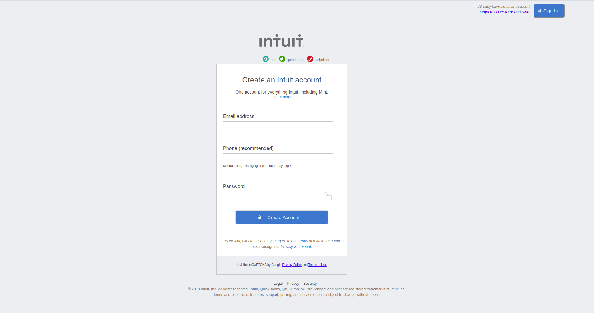

# HTML-FORMS


> This is a project for the Sign up form of a website called intuit 
> This is only a prototype of the Sign up page so its not functional

## Built With

- HTML
- CSS
- Linters
- Stickler
- VSCode
- Notepad++

## Live Demo

[Live Demo Link](https://euqueme.github.io/html-forms/)

## Automated Test

> there are no automated tests for this project yet

## Author

👤 **María Eugenia Quemé**

- Github: [@euqueme](https://github.com/euqueme)
- Linkedin: [María Eguenia Quemé Peña](https://www.linkedin.com/in/maria-queme/)

👤 **María Reyes**

- Github: [@majovanilla](https://github.com/majovanilla)
- Linkedin: [María José Reyes Parroquin](https://www.linkedin.com/in/majoreyesparroquin/)

## 🤝 Contributing

Contributions, issues and feature requests are welcome!

Feel free to check the [issues page](https://github.com/euqueme/html-forms/issues).

## Show your support

Give a ⭐️ if you like this project!

## Acknowledgments

We used the original intuit sign up page as a reference https://accounts.intuit.com

It is part of the Odin Project Curriculum "PROJECT: HTML FORMS
" (you can find the complete project [here](https://www.theodinproject.com/courses/html5-and-css3/lessons/html-forms))

This project it's also part of the Microverse Curriculum. www.microverse.org

## 📝 License

MIT

